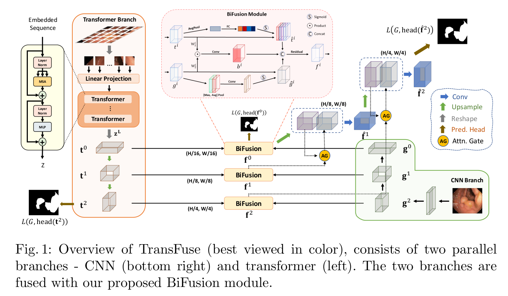

# TransFuse
This repo holds the code of TransFuse: Fusing Transformers and CNNs for Medical Image Segmentation

## Requirements
* Pytorch>=1.6.0, <1.9.0 (>=1.1.0 should work but not tested)
* timm==0.3.2


## Model Overview
<p align="center">
     <br />
</p>


## Experiments

### ISIC2017 Skin Lesion Segmentation Challenge
GPUs of memory>=4G shall be sufficient for this experiment. 

1. Preparing necessary data:
	+ downloading ISIC2017 training, validation and testing data from the [official site](https://challenge.isic-archive.com/data), put the unzipped data in `./data`.
	+ run `process.py` to preprocess all the data, which generates `data_{train, val, test}.npy` and `mask_{train, val, test}.npy`.
	+ alternatively, the processed data is provided in [Baidu Pan, pw:ymrh](https://pan.baidu.com/s/1EkMvfRj9pGCu1iqXjvg9ZA) and [Google Drive](https://drive.google.com/file/d/120hxkYc0vfzoSf4kYC6zpC7FH7XCVXqK/view?usp=sharing).

2. Testing:
	+ downloading our trained TransFuse-S from [Baidu Pan, pw:xd74](https://pan.baidu.com/s/1khwcCcTgwporZJcaTWedRg) or [Google Drive](https://drive.google.com/file/d/1hv1mfFkWEdYCR0FHPokovlf7OAFsnKgY/view?usp=sharing) to `./snapshots/`.
	+ run `test_isic.py --ckpt_path='snapshots/TransFuse-19_best.pth'`.

3. Training:
	+ downloading DeiT-small from [DeiT repo](https://github.com/facebookresearch/deit) to `./pretrained`.
	+ downloading resnet-34 from [timm Pytorch](https://github.com/rwightman/pytorch-image-models/releases/download/v0.1-weights/resnet34-43635321.pth) to `./pretrained`.
	+ run `train_isic.py`; you may also want to change the default saving path or other hparams as well.


Code of other tasks will be comming soon.


## Reference
Some of the codes in this repo are borrowed from:
* [Facebook DeiT](https://github.com/facebookresearch/deit)
* [timm repo](https://github.com/rwightman/pytorch-image-models)
* [PraNet repo](https://github.com/DengPingFan/PraNet)
* [Image_Segmentation](https://github.com/LeeJunHyun/Image_Segmentation)


## Citation
Please consider citing us if you find this work helpful:

```bibtex
@article{zhang2021transfuse,
  title={TransFuse: Fusing Transformers and CNNs for Medical Image Segmentation},
  author={Zhang, Yundong and Liu, Huiye and Hu, Qiang},
  journal={arXiv preprint arXiv:2102.08005},
  year={2021}
}
```

## Questions
Please drop an email to huiyeliu@rayicer.com

